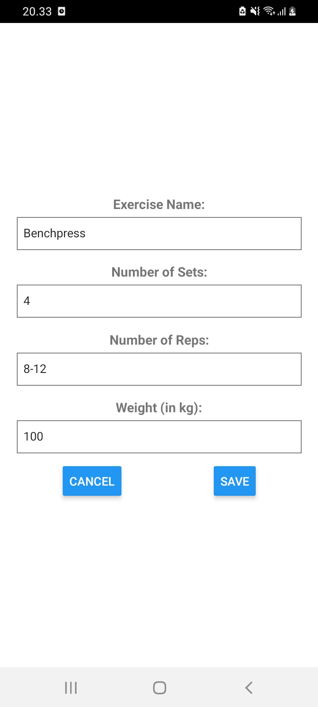
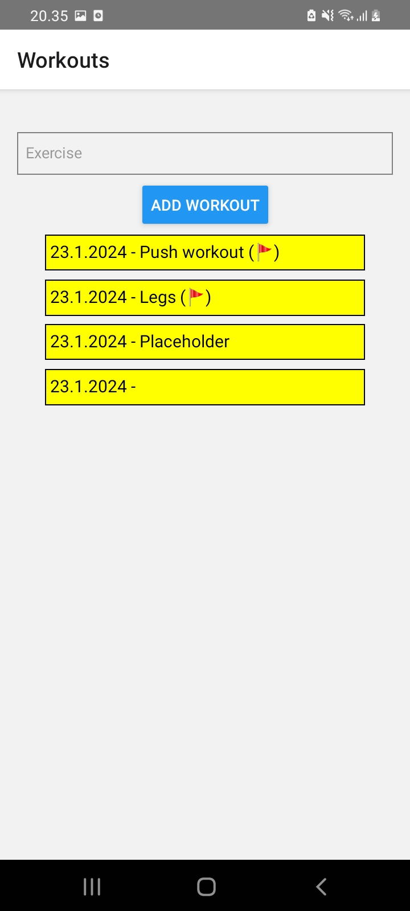
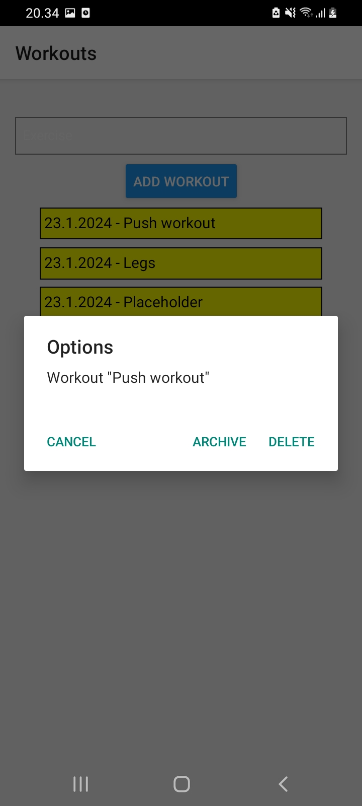
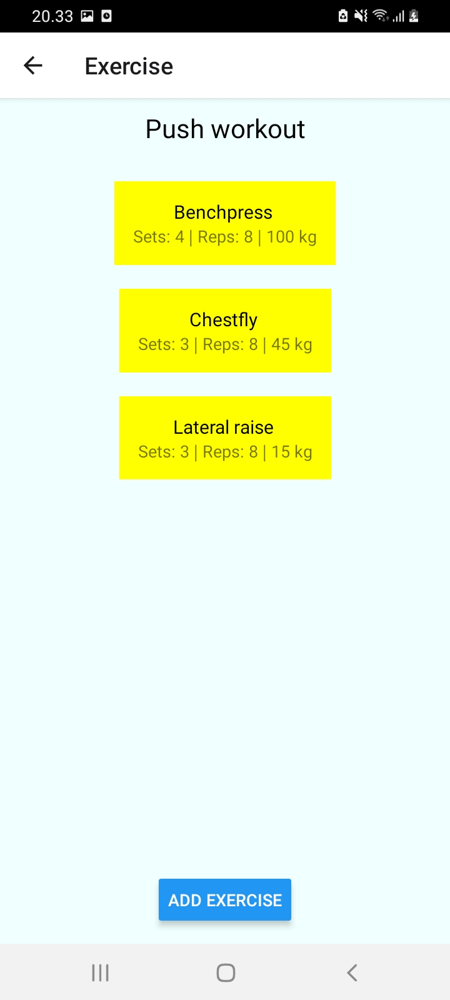

# Workout-tracking-mobile-app
A mobile application made with ReactNative to track your workouts by keeping track of the movements,sets and reps. the  You can add, manage or delete workouts to your liking. By long pressing a workout you get options to delete & archieve a workout. By clicking a workout you can add/edit your sets and reps of whatever movements. The application stores data locally by using SQLite to store all the information you want to track. I made this project a while back so some tendencies and packets might not be up to date. Ui and style is very basic could be a thing to upgrade in the future.
Be sure to follow the installion instructions!

## Table of Contents
- [Features](#features)
- [Code](#code)
- [Database](#database)
- [Installation](#installation)
- [Screenshots](#screenshots)

## Features
- Add/Delete workouts, sets and reps
- Store the data locally in your phone so you can keep track of workouts
- Archieve a workout with a flag marker

## Code
-Most of the code for the views can be found inside the components folder.
-Database directory holds the logic for database.
-The main app.js contains the program that initializes the db and handles the navigation
- package.json contians the dependencies

## Database
-SQLite
-Stores data locally

## Installation
-1.Install Node.js (if not already installed)
https://nodejs.org/

-Install React Native CLI
npm install -g react-native-cli

-2.Clone the repository and go inside the repository with the terminal 

-3.Update the dependencies  
-npm install

-4.Run the program either locally to have it on the go or use an emulator 
npx react-native run-android  # for Android

## Screenshots

---
